# ActiveMQ 教程
## JMS基本概念-1
* JMS是什么
  * JMS Java Mesage Service,Java消息服务，是Java EE重的一个技术。
* JMS规范
  * JMS定义了Java中访问消息中间件的接口，并没有给予实现，实现JMS接口的消息中间称为JMS Provider，例如 ActiveMQ
* JMS Provider :实现JMS接口和规范的小时中间件
* JMS message：JMS的消息，JMS消息有以下三部分组成：
  1. 消息头：每个消息头字段都有相应的getter和setter方法
  2. 消息属性： 如果需要除消息头字段以为的值，那么可以使用消息属性
  3. 消息提：封装具体的消息数据
* JMS Producer：消息生产者，创建和发送JMS消息的客户端应用
* JMS Consumer： 消息消费者，接受和处理JMS消息的客户端应用
* 消息的消费可以采用一下两种方法之一：
  1. 同步消费：通过调用消费者的receive方法从目的地中小时提取消息，receive方法可以一只阻塞到消息到达。
  2. 异步消费：客户可以为消费者注册一个消息监听器，以定义在消息到达时所采取的动作。
## JMS基本概念-2
  * JMS domains:消息传递域，JMS规范中定义了两个消息传递的域：点对点（point to point,简写成PTP）消息传递域和发布/订阅消息传递域（publish/subscribe,简写成pub/sub）
    1. 点对点消息传递域特点如下：
       1. 每个消息都只能有一个消费者，但是每个域都可以有多个消费者
       2. 消息的生产者和消费者之间没有时间上的相关性。无论消费者在生产者发送消息的时候是否处于运行状态，它都可以提取消息。
    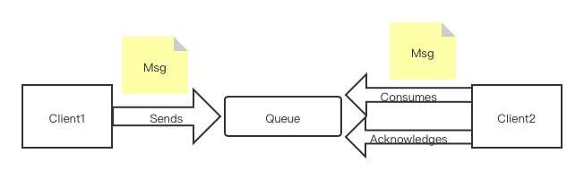
    
## JMS基本概念-3
 * 发布/订阅消息传递域的特点如下：
   * 每个消息可以有多个消费者
   * 生产者和消费者之间有时间上的相关性。订阅一个主题的消费者只能消费自它订阅之后发布的消息。持有订阅语序消费者消费他在为处于激活状态时发送的消息。
 * 在点对点消息传递域中，目的地被称为队列（queue）；在发布/订阅消息传递域中，目的地称为主题（topic）
    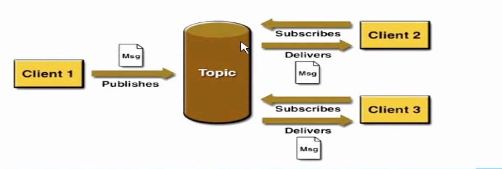

## JMS基本概念-4
* Connection factorv:连接工厂用来创建连接对象，以连按到JMS的provider
* JMS Connection: 封装了客户与JMS提供者之间的一个虚拟的连接
* JMS Session: 是生产和消费的一个单线程尚贤文
  * 会话用于创建消息生产者（producer）、消息消费者（consumer) 和消息（message）等。会话提供了一个事务性上下文，在这个上下文中，一组发送和接收被组合到了一个原子操作中。
* Destination:消息发送到的目的地
* Acknowledge: 签收
* Transaction: 事务
```java
//在创建session时就需要指定签收方式和事务
 Session session = connection.createSession(Boolean.TRUE, Session.AUTO_ACKNOWLEDGE);
```
* JMS client:用于收发消息的Java应用
* Non-JMS client:使用JMMS provider本地API写的应用，用于替换JMS API实现收发消息的功能，通常会提供其他的一些特性，比如：CORBA、RMI等
* Administered Objects:预定于的JMS对象，通常在provider规范中有定义，提供给JMS客户端来访问，比如：ConnectionFactory和Destination

## JMS的消息结构
### JMS消息头
* JMS消息由以下几个部分组成：消息头，属性和消息体。
* 消息头包含消息的识别信息和路由信息，消息头包含一些标准的属性如下：
  1. JMSDestination:由send方法设置
     1. 是指消息发送的目的地：主要指Queue和Topic，自动分配
     ```java
         //通过session来创建类型
         Destination destination = session.createQueue("my-queue");
         Destination destination = session.createTopic("my-topic");
     ```
  2. JMSDeliveryMode：由send方法设置
     1. 传送模式。有两种：持久模式和非持久模式。一条持久性的消息应该被传送"一次仅仅一次"，这就意味着如果JMS提供者出现故障，该消息并不会丢失，它会在服务器回复之后再次传递。一条非持久的消息最多会传送一次，这意味着这服务器出现故障，该消息将永远丢失。
  3. JMSExpiration：由send方法设置
     1. 消息过期时间，等于Destination的send方法中的timeToLibe值加上发送时刻的GMT时间值。如果timeToLive值等于零，则JMSExpiration被设为零，表示该消息永不过期。如果发送后，在消息过期时间之后消息还没有被发送到目的地，则该消息被清楚。自动分配
     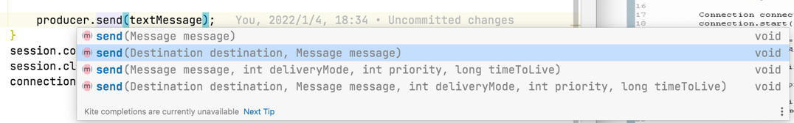
  4. JMSPriority：由send方法设置
     1. JMSPriority: 消息优先级，从0-9十个级别，0-4普通消息，5-9是加急消息。JMS不要求JMS Provider严格按照这十个优先级发送消息，但必须保证加急消息要先于普通消息达到。默认是4级。自动分配，同样在send方法处设置
     
  5. JMSMessageID：由send方法设置
     1. 每个消息的唯一标识，由JMS Provider产生。自动分配
  6. JMSTimestamp：由客户端设置
     1. JMS Provider在调用send()方法时自动设置的。他是消息发送和消费者实际接受的时间差。自动分配
  7. JMSCorrelationID：由客户端设置
     1. 用于连接到另外一个消息，应用在恢复消息中连接到愿消息。在大多数情况下，JMSCorrelationID用于将一条消息标记为对JMSMesssageID标识的上一条消息的答应，不过，JMSCorrelationID可以是任何值，不仅仅是JMSMessageID。有开发者设置。
  8. JMSReplyTo：由客户端设置
     1. 提供本消息恢复消息的目的地址。由开发者设置。发送完消息后，等待反馈到指定队列上去。
  9. JMSYType： 由客户端设置
     1. 消息类型的识别符。由开发者设置
  10. JMSRedelivered：由JMS Provider设置
      1. 如果一个客户端收到一个设置了JMSRedelivered属性的消息，则标识可能客户端曾经在早些时候收到过该消息，但并没有签收(acknowledged)。如果该消息被重新传送，JMSRedelivered = true反之，JMSRedelivered = false。自动设置
### JMS消息体
* JMS API定义了5中消息体格式，也叫消息类型，可以使用不同形式发送接受数据，并可以兼容现有的所有消息格式。包括：TextMessage、Mapmessage、BytesMessage、StreamMessage、和ObjectMessage
  ```java
    //通过session来创建,作为消息的附属信息
    for (int i = 0; i < 10; i++) {
            TextMessage textMessage = session.createTextMessage("message_" + i);
            textMessage.setStringProperty("shawn","shawn");

            //Thread.sleep(1000);

            producer.send(textMessage);
        }
  ```
### JMS消息属性
  * 包含一下三种类型的属性：
    1. 应用程序设置和添加的属性，比如:
    ```java
       Message.setStringProperty("username",username);
    ```
    2. JMS定义的属性
       使用"JMSX"作为属性名的前缀，
       ```java
       //方法返回所有连接支持的JMSX属性的名字。
       connection.getMetaData().getJMSXPropertyNamesI()
        ```
    3. JMS供应商特定的属性
       1. JMSXUserID：发送消息的用户标识，发送时提供商设置
       2. JMSXAppID：发送消息的应用标识，发送时提供商设置
       3. JMSXDeliveryCount:转发消息从事次数，第一次是1，第二次是2，···，发送时提供商设置
       4. JMSXGroupID：消息所在消息组的标识，由客户端设置
       5. JMSXGroupSeq：足内消息的序号第一个小时是1，第二个是2，···，有客户端设置
       6. JMSXGroupTXID：产生消息的事务的事务标识，发送时提供商设置
       7. JMSXConsumerTXID：消费消息的事务的事务标识，接收时提供商设置
       8. JMSXRcvTimestamp:JMS转发消息到消费者的时间，接收时提供商设置
       9. JMSXState：嘉定存在一个消息仓库，它储存了每个消息的单独拷贝，且这些消息从原始消息被发送时开始。每个拷贝的状态有：1（等待），2（转背），3（到期）或4（保留）。由于状态和生产者消费者无关，所以不是由它们来提供的，它只喝在仓库中查找消息相关，因此JMS没有提供这种AOPI。由提供商设置

## JMS的可靠性机制-1
* 消息接收确认
  * JMS消息只有在被确认后，才能认为已经被成功的消费了。消息的成功消费通常包含三个阶段:客户接受消息、客户处理消息和消息被确认
  * 在事务性会话中，当一个事务被提交的时候，确认自动发生。在非事务性会话中，消息合适被确认取决于创建会话时的应答模式(acknowledge mode)。该参数有以下三个可选值：
    1. Session.AUTO_ACKNOWLEDGE：当客户成功的从receive方法返回的时候，或者从MessageListener.onMessage方法成功返回的时候，会话自动确认客户收到的消息。
    2. Session.CLIENT_ACKNOWLEDGE：客户通过调用消息的acknowledge方法确认消息。需要注意的是，在这种模式中，确认是在会话成进行，确认一个被消费的消息，将自动确认所有已经被会话消费的消息。例如，如果一个消息消费者消费了10个消息，然后确认地5个消息，那么所有10个消息都被确认。
    3. Session.DUPS_ACKNOWLEDGE:该选择知识会话迟钝的确认消息的提交。如果JMS Provider失败，那么可能会导致一些重复的消息。如果是重复的消息，那么JMS Provider必须把消息头的JMSRedelivered字段设置为true
## JMS的可靠性机制-2
* 消息持久性，JMS 支持以下两种消息提交模式：
  1. PERSISTENT: 指示JMS provider 持久保存消息，以保证消息不会因为JMS provider的失败而丢失
  2. NON_PERSISTENT: 不要求JMS provider持久保存消息
  3. 消息优先级
     1. 从0-9共10个级别，默认4
  4. 消息过期
     1. 可以设置消息在一定事件后过期，默认是永不过期
  5. 会话创建临时queue或者topic,应用在receiver replyTo的队列上去
  ```java
    //sender创建tp queue
    TemporaryQueue tq = session.createTemporaryQueue();
    //并跟随message传递给receiver
     message.setJMSReplyTo(tq);
    //receive通过message接受临时队列为目的地，并可以回复。
    //Destination tq = message.getJMSReplyTo();
  
  
  ```
## JMS的可靠性机制-3
* 持久订阅
  1. 首先消息生产者必须使用PERSISTENT提交消息。客户可以通过会话上的createDurableSubscriber方法创建一个持久订阅，该方法的异地个参数必须是一个topic.第二个参数是订阅的名称。
  2. JMS Provider会存储发布到持久订阅的topic伤的消息。如果最初创建持久订阅的客户或者任何其他客户，使用相同的连接工厂和连接的客户ID，相同的主题和相同的订阅名，再次调用会话上的createDurablesSubscriber方法，那么该持久订阅就会被激活。JMS Provider会向客户发送客户处于非激活状态时所发布的消息。
  3. 持久订阅在莫哥时刻只能又一个激活的订阅这。持久订阅在创建后会一直保留，直到应用程序调用会话上的unsubscribe方法
* 本地事务
  * 在一个JMS客户端可以使用本地事务来组合消息的发送和接受。JMS Session接口提供了commit和rollback方法。
  * 事务性的会话总是千尺到事务处理中，commit或rollback方法一旦被调用，一个事务就结束了，而另一个事务被开始。关闭事务性的会话将回滚其中的事务
  * 如果使用请求/回复机制， 即发送一个消息，同时希望在同一个事务中等待接受该消息的回复，那么程序将被刮起，因为直到事务提交，发送操作才会真正执行，所以二者的事务需要分开提交。
  * 生产者消费者不能再同一个事务中。
## JMS的PTP模型
  * JMS PTP模型模型定义了客户段如何向队列发送消息，从队列接受消息，以及浏览队列中的消息。
    1. PTP模型基于队列的，生产者发送消息到队列，消费者从队列接受消息，队列中的存在使得消息的异步传输成为可能。和邮件系统中的邮箱一样，队列可以包含各种消息，JMS Provider 提供工具管理队列的创建、删除。
  * PTP的一些特点：
    1. 如果Session关闭，那些已经收到但未被签收的消息，在下次连接后还是会被接收
    2. 如果用户在receive方法中设定了消息选择条件，那么不符合条件的消息都会留在队列中，不会被接受到。
    3. 队列可长久地保存消息直到消费者收到消息。消费者不需要因为担心消息会丢失而时刻和队列保持激活状态，异步传输模式的优势
## JMS的Pub/Sub模型
  * JMS Pub/Sub模型定义了如何向一个内容节点发布和订阅消息，这些节点被称作topic
        主题可以被认为是消息的传输总结，发布者(publisher)发布消息到主题，订阅这(subscribe)从主题订阅消息。主题是消息的订阅这和消息发布者保持相互独立，不需要接触即可保证的传送。
  * Pub/Sub的特点：
    1. 消息订阅氛围非持久订阅和持久订阅：
       * 非持久订阅只有但客户端处于激活状态，也就是和JMS Provider保持连接状态才能接收到，离线会发生丢失，永远收不到。
       * 持久订阅，客户端向JMS注册一个识别自己身份的ID，但这个客户端处于离线时，JMS Provider会为这个ID保存所有发送到这个主题的消息，再次连接时，会根据ID获取所有保存的离线消息
    2. 如果用户在receive方法中设定了消息选择条件，那么不符合条件的消息都会留在队列中，不会被接受到。
    3. 非持久订阅不能恢复未签收的消息
    4. 但所有消息都必须被接收，则用持久订阅。当丢失消息能够被容忍，则用非持久订阅，从性能上来看
# JMS的API结构
  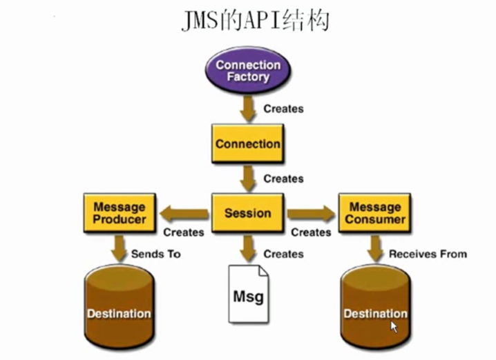
 ## JMS基本开发步骤
   1. 创建一个JMS connection factory
   2. 通过connection factory创建JMS connection
   3. 启动JMS connection
   4. 通过connection 创建JMS session
   5. 创建JMS destination
   6. 创建JMS producer，或者创建JMS message，并设置destination
   7. 创建JMS consumer ，或者是注册一个JMS message listener
   8. 发送或者接收JMS messages
   9. 关闭所有的JMS资源（connection,session,producer,consumer）
## 非持久的Topic消息示例
   * 对于非持久的Topic消息的发送
     * 基本嗯前面发送队列信息一样，指示把创建Destination的地方，由创建队列替换为Topic
     ```java
        Destination destination = session.createTopic("myTopic");
     ```
     * 对于非持久的Topic消息的接收
        1. 必须要接收方在线，然后客户端在发送信息，接收方才能接收到消息
        2. 同样把创建Destination的地方，由创建队列替换成创建Topic，
        ```java
        Destination destination = session.createTopic("myTopic");
        ```
        3. 由于不知道客户端发送多少信息，因此改为while循环的方式了
        ```java
        Message message = consumer.receive();
        while (message != null){
            TextMessage txtMessage = (TextMessage) message;
            System.out.println("收到的消息:" + txtMessage.getText());
            message = consumer.receive(1000L);
        }
        ```
     * 对于持久的Topic消息的发送
     ```java
        public static void main(String[] args) throws JMSException {
        ActiveMQConnectionFactory activeMQConnectionFactory = new ActiveMQConnectionFactory("tcp://127.0.0.1:61616");
        Connection connection = activeMQConnectionFactory.createConnection();
        Session session = connection.createSession(Boolean.TRUE, Session.AUTO_ACKNOWLEDGE);
        Destination destination = session.createTopic("myPersistenceTopic");
        TemporaryQueue tq = session.createTemporaryQueue();

        MessageProducer producer = session.createProducer(destination);
        //设置持久化模式
        producer.setDeliveryMode(DeliveryMode.PERSISTENT);
        //一定要设置完成后创建连接
        connection.start();

        for (int i = 0; i < 10; i++) {
            TextMessage message = session.createTextMessage();
            message.setText("message"+i);
            message.setJMSReplyTo(tq);
            producer.send(message);
        }
        session.commit();
        session.close();
        connection.close();
     }
     ```
   * 对于持久的Topic消息的接收
   ```java
    public static void main(String[] args) throws JMSException {
        ActiveMQConnectionFactory activeMQConnectionFactory = new ActiveMQConnectionFactory("tcp://127.0.0.1:61616");
        Connection connection = activeMQConnectionFactory.createConnection();
        //创建唯一ID，识别消费者
        connection.setClientID("textID998");
        Session session = connection.createSession(Boolean.TRUE, Session.AUTO_ACKNOWLEDGE);
        Enumeration names = connection.getMetaData().getJMSXPropertyNames();
        while (names.hasMoreElements()){
        System.out.println(names.nextElement());
        }
        Topic destination = session.createTopic("myPersistenceTopic");
        //需要创建TopicSubscriber来订阅
        TopicSubscriber ts = session.createDurableSubscriber(destination,"T1");
        //都设置好了才能创建连接
        connection.start();
        Message message = ts.receive();
        while (message != null){
        TextMessage txtMessage = (TextMessage) message;
        System.out.println("收到的消息:" + txtMessage.getText());
        message = ts.receive(1000L);
        }
        session.commit();
        session.close();
        connection.close();
    }
   ```
    1. 一定线运行一次，等于向消息服务中间件注册这个消费者，然后在运行客户端发送信息的，这个时候无论消费者是否在线，都会接收到，不在线的话，先吃连接的时候，会把没有受过的信息都接收下来。
    
## 关于持久化和非持久化消息
* 持久化消息
  * 这是ActiveMQ的默认传送模式，吃模式保证这些消息只被传送和成功一次。对于这些消息，可靠性是优先考虑的因素。可靠性的另一个重要方面是确保持久性消息传送至目标后，消息服务在向消费者传送他们之前不会丢失这些消息。
  * 这意味着在持久性消息传送至目标时，消息服务将其放入持久性数据存储。如果消息服务将其放入持久性数据存储。如果消息服务由于魔钟原因导致失败，他可以恢复此消息并将消息传送至相应的消费者。虽然这样增加了消息传送的开销，但却增加了可靠性。
* 非持久化消息
  * 保证这些消息最多被传送一次。对于这些消息，可靠性并非主要的考虑因素。此模式并不要求持久性的数据存储，也不保证消息服务由于失败后丢失消息。有两种方法指定传送模式：
    1. 使用setDeliveryMode方法，这样的消息都采用此传送模式；如：producer.setDeliveryMode(DeliveryMode.NON_PERSISTENT);
    2. 使用send方法为每一条消息设置传送模式。
    
## 用ActiveMQ构建应用-1
  * Broker：相当于一个ActiveMQ服务器实例
  * 命令行启动参数示例：
    1. activemq start: 使用默认的acrivemq.xml来启动
    2. activemq start xbean:file:../conf/activemq-2.xml:使用指定的配置文件来启动
    3. 如果不指定file，也就是xbean:activemq-2.xml,那么xml必须在classpath下面
  * 用ActiveMQ来构建Java应用
    * 将ACtiveMQ Broker作为独立的消息服务器来构建JAVA应用。ActiveMQ也支持在vm中通信基于嵌入式的broker，能够无缝的集成其他Java应用
## 用ActiveMQ构建应用-2
  * 嵌入式Broker启动
    1. Broker Service启动broker,示例：
```java
public static void main(String[] args) throws Exception {
        BrokerService broker = new BrokerService();
        broker.setUseJmx(true);
        broker.addConnector("tcp://localhost:61616");
        broker.start();
    }
```


```java
        String Uri = "properties:broker.properties";
        BrokerService broker = BrokerFactory.createBroker(new URI(Uri));
        broker.addConnector("tcp://localhost:61616");
        broker.start();
```

[第二种内嵌broker需要配置broker.properties文件](src/main/resources/broker.properties)
 
### 用ActiveMQ构建应用-3 
   * 将brokerService配置在applicationContext.xml中随着spring的启动而启动。
   * 注意一下三点
     1. 添加spring jar包 [pom.xml](pom.xml)
     2. applicationContext.xml spring配置文件配置单例broker实例 [applicationContext.xml](src/main/resources/applicationContext.xml)
     3. 在main方法中启动配置文件`ApplicationContext ctx = new ClassPathXmlApplicationContext("applicationContext.xml");`

   * 将brokerFactory配置在spring的配置文件中启动
   * 如果需要启动多个broker这需要给broker设置一个名字`broker.setName("test1")`,且connector要设置不一样的uri

# ActiveMQ结合Spring开发-1
* Spring提供了对JMS的支持，需要添加Spring支持的jms的包，如下：
```xml
<dependency>
            <groupId>org.springframework</groupId>
            <artifactId>spring-tx</artifactId>
            <version>4.0.0.RELEASE</version>
        </dependency>
        <dependency>
            <groupId>org.springframework</groupId>
            <artifactId>spring-jms</artifactId>
            <version>4.0.3.RELEASE</version>
        </dependency>
        <dependency>
            <groupId>org.apache.activemq</groupId>
            <artifactId>activemq-pool</artifactId>
            <version>5.9.0</version>
        </dependency>
```
* 然后在Spring的配置文件中，配置jmsTemplate :
```xml
 <bean id="jmsFactory" class="org.apache.activemq.pool.PooledConnectionFactory" destroy-method="stop">
        <property name="connectionFactory">
            <bean class="org.apache.activemq.ActiveMQConnectionFactory">
                <property name="brokerURL">
                    <value>tcp://http://127.0.0.1:61616</value>
                </property>
            </bean>
        </property>
        <property name="maxConnections" value="100"></property>
    </bean>
    <bean id="jmsTemplate" class="org.springframework.jms.core.JmsTemplate">
        <property name="connectionFactory" ref="jmsFactory"/>
        <property name="defaultDestination" ref="destination"/>
        <property name="messageConverter">
            <bean class="org.springframework.jms.support.converter.SimpleMessageConverter"/>
        </property>
    </bean>
    <bean id="destination" class="org.apache.activemq.command.ActiveMQQueue">
        <constructor-arg index="0" value="spring-queue"/>
    </bean>
```
```xml
<!--自动扫包-->
<context:component-scan base-package="com.shawnNicole.jmstest">
        <context:exclude-filter type="annotation" expression="org.springframework.stereotype.Controller"/>
    </context:component-scan>
    <aop:aspectj-autoproxy proxy-target-class="true"/>
```
* topic需要更改配置中的destination
```xml
 <bean id="jmsTemplate" class="org.springframework.jms.core.JmsTemplate">
    <property name="connectionFactory" ref="jmsFactory"/>
    <property name="defaultDestination" ref="destinationTopic"/>
    <property name="messageConverter">
        <bean class="org.springframework.jms.support.converter.SimpleMessageConverter"/>
    </property>
</bean>
<bean id="destinationTopic" class="org.apache.activemq.command.ActiveMQTopic">
        <constructor-arg index="0" value="spring-topic"/>
    </bean>
```
如果想要在spring中配置消费者的话，就不需要在启动接收客户端了：
```xml
<!--    在spring中配置消费者，这样不需要在启动客户端-->
    <bean id="jmsContainer" class="org.springframework.jms.listener.DefaultMessageListenerContainer">
        <property name="connectionFactory" ref="jmsFactory"/>
        <property name="destination" ref="destinationTopic"/>
        <property name="messageListener" ref="messageListener"/>
    </bean>
    <bean id="messageListener" class="com.shawnNicole.jmstest.spring.MyMessageListener">
    </bean>
```
```java
//com.shawnNicole.jmstest.spring.MyMessageListener
//配置监听器，创建监听消息的的类
package com.shawnNicole.jmstest.spring;

import javax.jms.JMSException;
import javax.jms.Message;
import javax.jms.MessageListener;
import javax.jms.TextMessage;

/**
 * @ProjectName: activemq-study
 * @Package: com.shawnNicole.jmstest.spring
 * @ClassName: MyMessageListener
 * @Description: []
 * @Author: [Shawn Wu]
 * @Date: 2022/2/12 00:43
 * @Version: V1.0
 * @Copyright: 2021  Inc. All rights reserved.
 * @TODO: 注意, 本文件Shawn Wu 所作,如果转载或使用请标明具体出处!
 **/
public class MyMessageListener implements MessageListener {


    @Override
    public void onMessage(Message message) {
        TextMessage msg = (TextMessage) message;
        System.out.println("receive msg:"+msg);
    }
}

```
# ActiveMQ结合Spring开发-2
* ActiveQM结合Spring开发最佳实践和建议
  1. Spring消息发送的核心框架JmsTemplate，隔离了像打开，关闭Session、Producer的操作，因此开发人员仅仅需要关注实际业务逻辑但是JmsTemplate损害了ActiveMQ的PooledConnectionFactory对Session和消息producer的缓存机制而带来的性能提升
  2. 新Spring可以在设置创建ConnectionFactory中，指定Cache属性：`org.springframework.jsm.connection.CachingConnectionFactory`的sessionCacheSize,或者用ActiveMQ的PooledConnectionFactory
  3. 不建议使用JmsTemplate的receive()调用，因为JmsTemplate都是同步方法，调用意味线程阻塞，影响性能
     1. 请使用`DefaultMessageListenerContainer`,它允许异步接受消息，并缓存`Session`和消息`consumer`，而且还可以根据消息数量动态增减和所见监听器的数量

# 连接到ActiveMQ
* Connector:ActiveMQ提供的，用来实现连接通讯的功能。包括：client-to-broker、broker-to-broker。ActiveMQ允许客户端使用多种协议来连接
* 配置Transport Connector，在conf/activemq.xml里配置，在标签`<transportConnectors>`中详细配置了相关连接协议。
```xml
  <transportConnectors>
            <!-- DOS protection, limit concurrent connections to 1000 and frame size to 100MB -->
            <transportConnector name="openwire" uri="tcp://0.0.0.0:61616?maximumConnections=1000&amp;wireFormat.maxFrameSize=104857600"/>
            <transportConnector name="amqp" uri="amqp://0.0.0.0:5673?maximumConnections=1000&amp;wireFormat.maxFrameSize=104857600"/>
            <transportConnector name="stomp" uri="stomp://0.0.0.0:61613?maximumConnections=1000&amp;wireFormat.maxFrameSize=104857600"/>
            <transportConnector name="mqtt" uri="mqtt://0.0.0.0:1883?maximumConnections=1000&amp;wireFormat.maxFrameSize=104857600"/>
            <transportConnector name="ws" uri="ws://0.0.0.0:61614?maximumConnections=1000&amp;wireFormat.maxFrameSize=104857600"/>
        </transportConnectors>
```
* ActiveMQ支持的client-broker通讯协议如下：
  1. TCP 这个也是缺省使用的签协议
  2. NIO
  3. UDP
  4. SSL
  5. Https
  6. VM ：如果客户端和broker在一个虚拟机内的话，通过VM协议通讯在VM内同寻可以减少网络传输开销

# ActiveMQ支持的传输协议和配置-1
* Transmission Control Protocol(TCP)
  1. 这是默认的Broker配置，TCP的Client监听端口是61616
  2. 在网络传输数据签必须要序列化数据，消息是通过wire protocol序列化成字节流。默认情况，activeMQ把wire protocol叫做OpenWire，她的目的是促使网络上的效率和数据快速交互
  3. TCP连接的URI形式：tcp://hostName:port?key=value&key=value
  4. TCP传输优点：
     1. 传输可靠性，稳定性强
     2. 字节流传递，效率高
     3. 应用广泛，支持任意平台
  5. 关于Transport协议的可配置参数参见
     * http://activemq.apache.org/configuring-version-5-transports.html
* New I/O API Protocol(NIO)
  1. NIO协议域TCP协议类似，但NIO更侧重底层的访问操作。它允许开发人员对统一资源有更多的client调用和服务端有更多的负载
  2. 适合使用NIO协议的场景
     1. 可能有大量的Client连接到Broker上，一般情况下大量的Client连接Broker是被操作系统的线程数限制的，因此NIO的实现比TCP需要更少的线程去运行，所以建议使用NIO协议
     2. 可能对Broker有个很迟钝的网络传输，NIO比TCP提供更好的性能
     3. 连接方式：nio://hostname:port?key=value
     4. transport Connector配置示例：
     ```xml
     <transportConnectors>
            <transportConnector name="tcp" uri="tcp://localhost:61616?trace=true"/>
            <transportConnector name="nio" uri="nio://localhost:61618?trace=true"/>
        </transportConnectors>
     ```
     
* User Datagram Protocol(UDP)
  1. UDP与TCP区别
     1. TCP保证数据包不会被复制和丢失
     2. TCP确保发送和接收之间可靠传输，UDP仅仅是连接协议，没有可靠性一说
  2. TCP被用于可靠稳定的使用场景，udp用于快速传递数据和不怕数据丢失场景中，在ActiveMQ通过防火墙时，只能用UDP
  3. 连接形式：udp://hostName:port?key=value&key=value
  4. transport Connector配置示例：
     ```xml
        <transportConnectors>
            <transportConnector name="udp" uri="udp://localhost:61617?trace=true"/>
        </transportConnectors>
     ```
* Secure Socket Layer Protocol(SSL)
  1. 连接形式：ssl://hostName:port?key=value&key=value
  2. transport Connector配置示例：
     ```xml
        <transportConnectors>
            <transportConnector name="ssl" uri="ssl://localhost:61619?trace=true"/>
        </transportConnectors>
     ```
* Hypertext Transfer Protocol(http/https)
  1. 像web和email等服务需要通过防火墙来访问的，http可以使用这种场合
  2. 连接方式：http://hostName:port?key=value&key=value或https://hostName:port?key=value&key=value
  3. transport Connector配置示例：
     ```xml
        <transportConnectors>
            <transportConnector name="http" uri="http://localhost:8080?trace=true"/>
        </transportConnectors>
     ```
* VM Protocol(VM)
  1. VM Transport允许在VM内部通讯，避免网络开销，不是socket连接，而是方法调用。
  2. 第一个创建VM连接的客户会启动一个embed VM broker，接下来所有使用相同的broker name的vm连接都会使用这个Broker。当这个Broker上所有的连接都关闭的时候，Broker也会自动关闭
  3. URI形式：vm://hostName:port?key=value&key=value
  4. Java中嵌入方式：
     1. vm:broker:(tcp://localhost:6000)?brokerName-embededbroker&persistent=false,定义了一个嵌入的Broker名称为embededbroker以及配置一个tcptransprotconnector在监听端口6000
  5. 使用一个家在一个配置文件来启动broker
     * vm://localhost?brokerConfig=xbean:activemq.xml 
  6. 因为都是分布式使用MQ所以在同一虚拟机使用activemq vm连接方式不常用

# ActiveMQ的消息存储持久化
* ActiveMQ不仅支持persistent和nonpersistent两种方式。还支持消息的恢复(recovery)方式
* PTP
  * Queue的存储是很简单的，就是一个FIFO的Queue
* PUB/SUB 对于持久化订阅，每个消费者获得一个消息的复制

* 有效的消息存储
  * ActiveMQ提供一个插件式的消息存储，类似于消息的多点传播，主要实现了如下几种：
    1. AMQ消息存储-基于文件存储方式是以前的默认消息存储
    2. KahaDB消息存储-提供了荣来给你的提升和恢复能力，是现在的默认存储方式
    3. JDBC消息-消息基于JDBC存储的
    4. Memory 消息存储-基于内存的消息存储
* KahaDB message Store概述
  * 5.9版本默认的存储方式，可用于任何场景，提高了性能和恢复能力，使用事务日志和晶晶一个索引文件来存储它所有的地址。
  * KahaDB是一个专门针对消息持久化的解决方案，他对典型的消息使用模式进行了优化。在Kaha中，数据被追加到了data logs中。但不再需要log文件中的数据的时候，log文件就会被丢弃
  * KahaDB基本配置例子
  ```xml
     <persistenceAdapter>
            <kahaDB directory="${activemq.data}/kahadb"/>
        </persistenceAdapter>
  ```
  * 可用的属性有：
    1. director：存放的路径，默认activemq.data
    2. indexWriteBatchSize:批量写入磁盘的索引page数量，默认值1000
    3. indexCacheSize：内存中缓存索引page的数量默认10000
    4. enableIndexWriteAsync：是否异步写出索引，默认false
    5. journalMaxFileLength：设置每个消息datalog的大小，默认32MB
    6. enbaleJournalDiskSync：设置是否保证每个没有事务的内容，被同步写入磁盘JMS持久化的时候需要，默认true
    7. cleanupInterval：在检查到不再使用消息后，在具体删除消息前的时间默认30000
    8. checkpointInterval:checkpoint的间隔时间，默认5000
    9. ignoreMissingJournalfiles:是否忽略丢失的消息日志文件，默认false
    10. checksumJournalFiles：是否为每个消息日志文件提供checksum，默认false
    11. checkForCorruptJournalFiles：在启动的时候将会验证消息文件是否损坏，默认false
    12. archiveDataLogs：是否移动文件到指定的路径，而不是删除他们，默认false
    13. directoryArchive：定义消息已经被消费过后，移动data log到的路径，默认null
    14. databaseLockedWaitDelay：获得数据库锁的等待时间(used by shared master/slave)，默认10000
    15. maxAsyncJobs：设置最大的可以存储的异步消息队列，默认值10000，可以和concurrentMessageProducers设置成一样的值
    16. concurrentStoreDispatchTransactions：是否分发消息到客户端，同时事务存储消息，默认true
    17. concurrentStoreAndDispatchTopic：是否分发Topic到客户端，同时进行存储，默认true
    18. concurrentStoreAndDispatchQueues：是否分发queue消息到客户端，同时进行存储，默认true
  * 在Java中内嵌使用Broker，使用KahaDB的例子
```java
package com.shawnNicole.jmstest.kahaDB;

import org.apache.activemq.broker.BrokerService;
import org.apache.activemq.store.kahadb.KahaDBStore;

import java.io.File;

/**
* @ProjectName: activemq-study
* @Package: com.shawnNicole.jmstest.kahaDB
* @ClassName: EmbededBrokerUsingKahaDBStoreExample
* @Description: []
* @Author: [Shawn Wu]
* @Date: 2022/2/12 16:20
* @Version: V1.0
* @Copyright: 2021  Inc. All rights reserved.
* @TODO: 注意, 本文件Shawn Wu 所作,如果转载或使用请标明具体出处!
  **/
  public class EmbededBrokerUsingKahaDBStoreExample {
  //创建java内置broker时定义及配置kahadb
  BrokerService createEmbededBroker() throws Exception{
  BrokerService broker = new BrokerService();
  File dateFileDir = new File("target/amq-in-action/kahadb");
  KahaDBStore kaha = new KahaDBStore();
  kaha.setDirectory(dateFileDir);
  kaha.setJournalMaxFileLength(1024*100);
  kaha.setIndexWriteBatchSize(100);
  kaha.setEnableIndexWriteAsync(true);
  broker.setPersistenceAdapter(kaha);
  broker.addConnector("tcp://127.0.0.1:61616");
  broker.start();
  return broker;
  }

}
```
* AMQ Message Store概述
  * AMQ Message Store是5.0缺省的持久化存储，依赖于文件事务存储设计为快速消息存储的一个结构，该结构是以流的形式来进行消息交互的。
  * Messages被保存到data logs中，同时被reference store进行索引以告诉存取速度。data logs由一些单独的data log文件组成，缺省的文件大小是32M。如果某个消息的大小超过了data log的大小，那么可以修改配置增加data log的大小。如果某个data log文件中所有的的消息都被成功消费了，那么这个datalog文件会被标记删除或归档
  ```xml
        <persistenceAdapter>
            <amqPersistenceAdapter directory="${activemq.data}/data" maxFileLength="32mb"/>
        </persistenceAdapter>
  ```
* 使用JDBC来持久化消息，预定义的表如下：
  1. 消息表，缺省表名为ACtiveMQ——MSGS，queue和topic都存在里，结构如下
  
  2. ACTIVEMQ_ACKS表存储持久订阅的信息和最后一个持久订阅接受的信息ID，结构如下：
  
  3. 锁定表，缺省表名为ACTIVEMQ_LOCK，用来保证再摸一时刻，只能有一个ActiveMQ broker实例访问数据库，结构如下：
  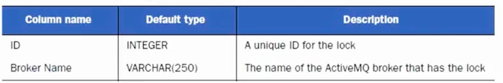
```sql
//对应表的建表语句
create database test;
use test;
create table activemq_msgs
(
    ID         integer,
    CONTAINER  varchar(250),
    MSGID_PROD varchar(250),
    MSGID_SEQ  integer,
    EXPIRATION BIGINT,
    MSG        BLOB
);
create table activemq_acks
(
    CONTAINER     varchar(250),
    SUB_DEST      varchar(250),
    CLIENT_ID     varchar(250),
    SUB_NAME      varchar(250),
    SELECTOR      varchar(250),
    LAST_ACKED_ID integer
);
create table activemq_lock
(
    ID          integer,
    Broker_Name varchar(250)
);
```
* 对应在activeMQ broker配置
```xml

    <persistenceAdapter>
<!--        切换成jdbc持久化存储-->
        <!--<kahaDB directory="${activemq.data}/kahadb"/>-->
         <jdbcPersistenceAdapter dataSource="#mysql-ds"/>
    </persistenceAdapter>
<!--    jdbc配置数据源-->
    <bean name="mysql-ds" class="org.apache.commons.dbcp2.BasicDataSource" destroy-method="close">
    <property name="driverClassName">
        <value>
            org.gjt.mm.mysql.Driver
        </value>
    </property>
    <property name="url">
        <value>
            jdbc:mysql://localhost:3306/test?useUnicode=true&amp;characterEncoding=UTF-8
        </value>
    </property>
    <property name="username">
        <value>
            root
        </value>
    </property>
    <property name="password" value="MyNewPass1!"/>
    </bean>
```
* JDBC Message Store with ActiveMQ Journal
  * 这种方式克服了JDBC store的不足，使用快速的缓存写入技术，大大提高了性能。配置：
  ```xml
    <!--    注释掉 persistenceAdapter-->
      <!-- <persistenceAdapter>
           切换成jdbc持久化存储-->
        <!--<kahaDB directory="${activemq.data}/kahadb"/>
         <jdbcPersistenceAdapter dataSource="#mysql-ds"/>
    </persistenceAdapter>-->
  ```
  * 新增persistenceFactory配置：
  
* JDBC Store和JDBC Message Store with ActiveMQ Journal的区别
    1. Jdbc with journal的性能优于jdbc
    2. Jdbc用于master/slave模式的数据库分享
    3. Jdbc with journal不能用于master/slave模式
    4. 推荐jdbc with journal

* Memory message Store
* 内存消息存储，存储所有的消息在内存中，因为没有动态缓存存在，要注意broker所在的JVM和内存限制
* 配置示例：

# 在一台服务器上启动多个Broker
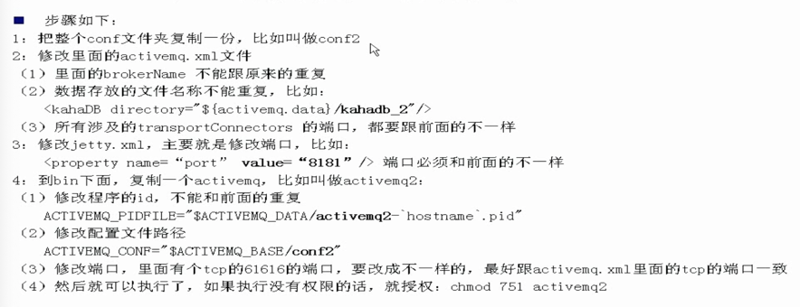

1. 新建conf目录并配置activemq.xml jetty.xml
2. 创建 bin/activemq2脚本 并配置
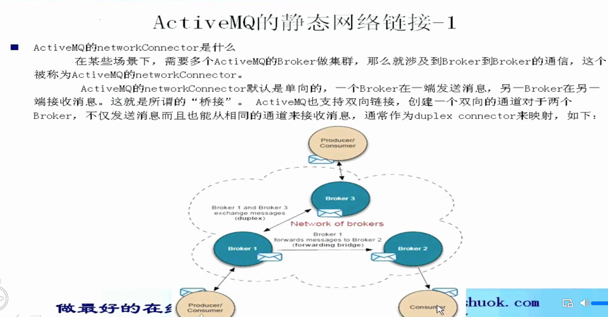
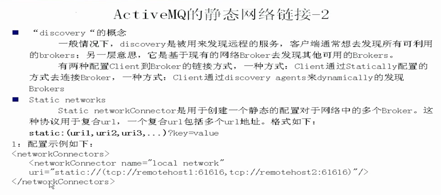
* 在/conf/activemq.xml中做networkConnectors标签配置
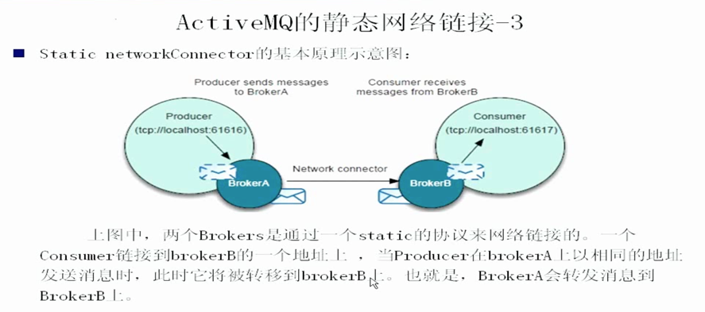
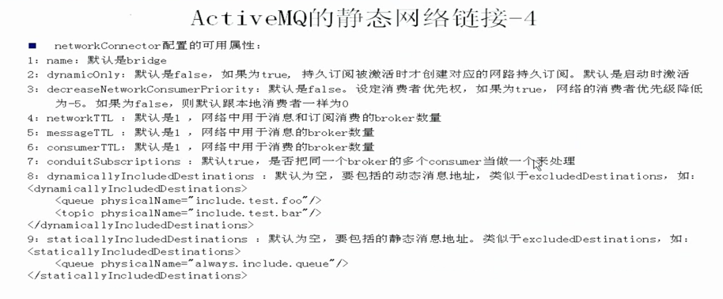
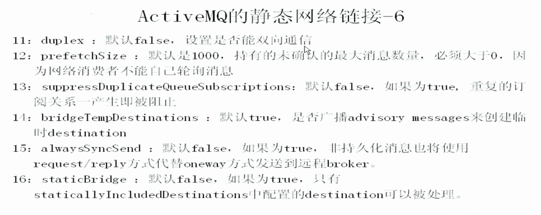
* 防丢失回流配置策略replayWhenNoConsumers，防止b1无人消费的消息，在消费者连接到b2后，造成消息丢失，需要b1，b2都配。配置成双向的duplex无法解决问题，因为b1的消息来源于b2并非产生于b1，无法双向发送到b2。做集群时需要用到
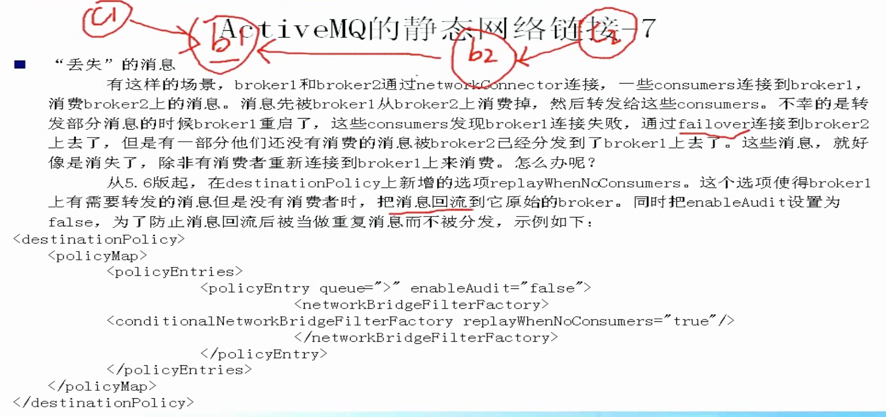
# 容错的链接和动态网络连接
* 容错的链接-1(Failover 协议)
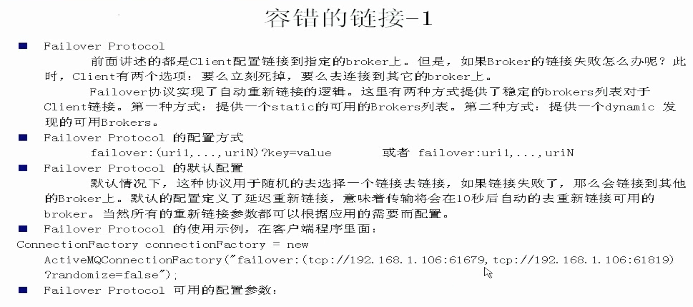
* 容错的链接-2(容错链接的参数)
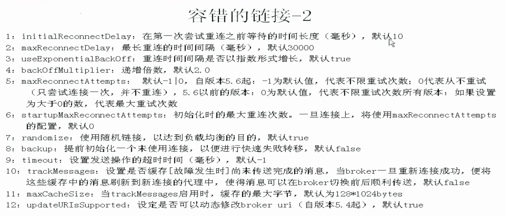
* 动态网络链接需要多播网络的支持，连接到一组服务器上，并不指定某一个特定的服务器
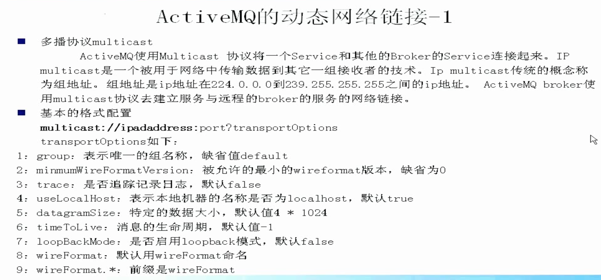
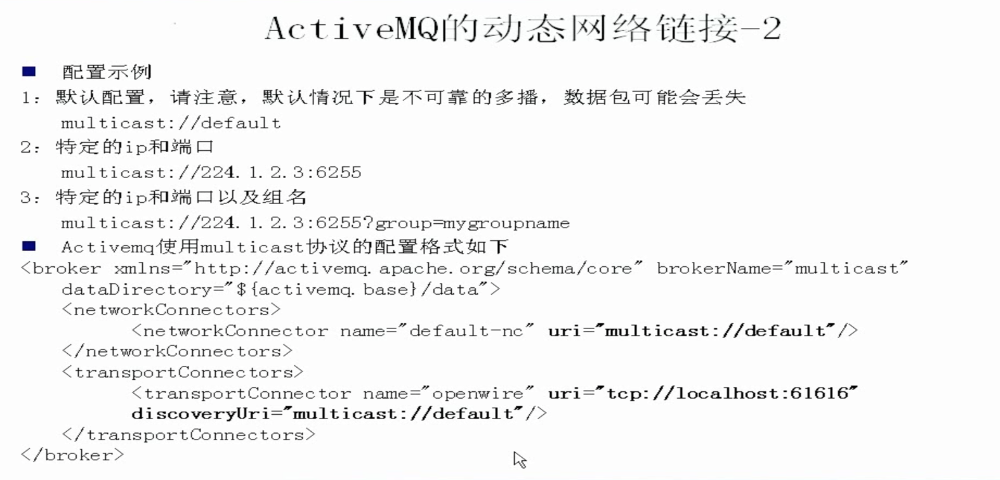
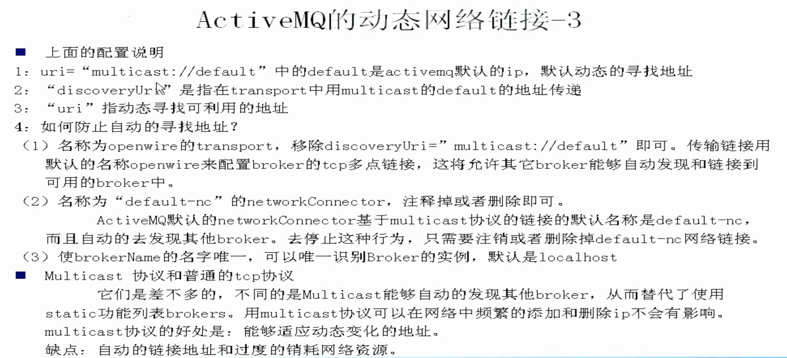
* 用于多播协议的Discovery协议，动态发现多播
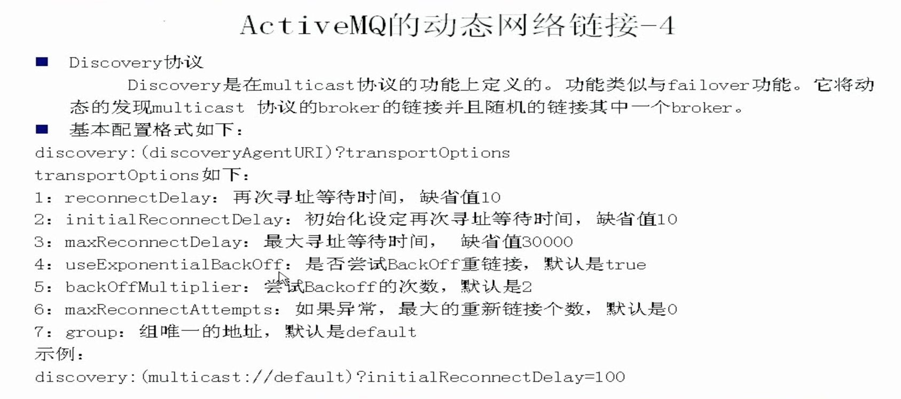
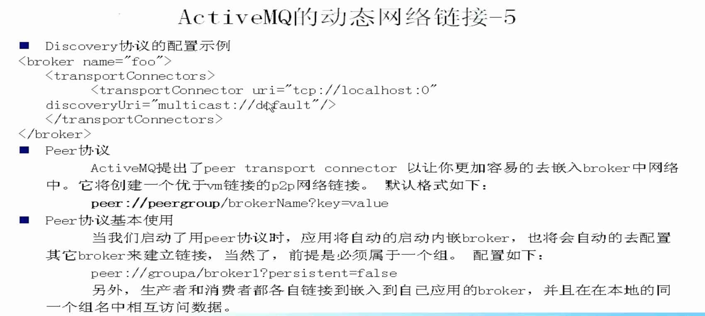